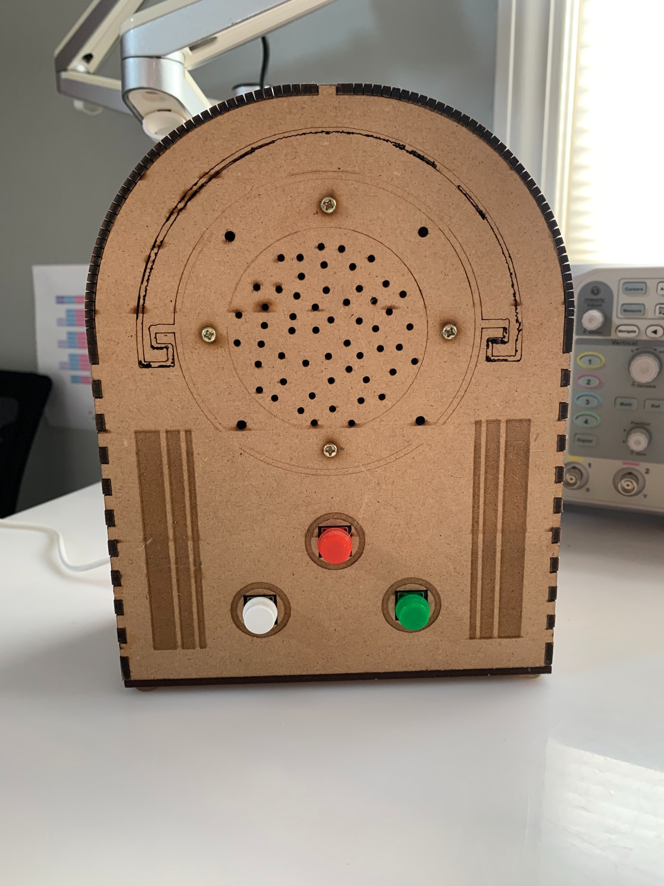

# Казкар



**Казкар** means **“storyteller”** in Ukrainian.

**Казкар** is a three-button audio player built around an **Arduino Uno**, a **microSD card module**, an **8Ω speaker**, and a **custom LightBurn-designed enclosure** cut from **3.0 mm MDF board**. It was designed as a child-friendly, screen-free listening device for audiobooks and spoken-word audio without menus, apps, or extra interface clutter.

This project is one of my early embedded/electronics integration milestones: it combines removable media playback, physical controls, enclosure design, and portable power into one working standalone object.

## Why I built it

Many audio devices for children assume a screen, a complicated UI, or access to a phone or tablet. Казкар was an attempt to make something narrower and more deliberate:

- three physical buttons
- direct speaker playback
- no screen
- no app
- simple, repeatable interaction

The goal was not to create a polished consumer product on the first try. The goal was to make a real working device that solved a narrow problem with simple hardware and firmware.

Part of the point was cultural as well as technical: many children today do not recognize what a radio is, let alone how to use a listening-first device with no screen. Казкар uses modern components—microSD storage, Arduino control, and USB power—to recreate a much older mode of interaction: **press a button, listen, follow the story by ear**. The, enclosure was, therefore, intentionally designed to resemble an **antique radio**.

The larger goal was to encourage **auditory attention and listening skills** without relying on visuals. A lot of current entertainment and educational media assumes a screen, a menu, or some other visual anchor. Казкар moves in the opposite direction. It is built around sound, memory, sequence, and spoken storytelling.

## What it does

Казкар plays WAV audio files from a microSD card and uses three front-panel buttons for basic navigation:

- **Red** — Play/Pause
- **White** — Previous
- **Green** — Next

The final physical layout matches the finished enclosure:

- **speaker** at the top
- **red play/pause** centered below the speaker
- **white previous** at the lower left
- **green next** at the lower right

The current firmware uses:

- `D5` — Play/Pause
- `D6` — Next
- `D7` — Previous
- `D9` — speaker output
- `D4` — microSD chip select
- `D11` / `D12` / `D13` — SPI for the microSD module

## Core hardware

- Arduino Uno
- microSD card module over SPI
- 3 large momentary pushbuttons with plastic housings/caps
- 8Ω speaker, 70 mm diameter
- 3.0 mm MDF enclosure panels
- 2200 mAh USB power bank for normal portable use

## Firmware behavior

On startup the sketch initializes the SD card, sets the playback volume, and begins with `song1.wav`. The Play/Pause button toggles playback, the Next button advances to the next numbered track, and the Previous button returns to the prior numbered track.

The uploaded sketch configures:

- `pp = 5`
- `next = 6`
- `prev = 7`
- `speakerPin = 9`
- `SD_ChipSelectPin = 4`

## Audio workflow

The device uses `TMRpcm` for WAV playback. The current implementation expects sequentially named WAV files on the microSD card:

- `song1.wav`
- `song2.wav`
- `song3.wav`
- ...
- `song11.wav`

## Build progression

Казкар evolved through three visible stages:

1. breadboard proof of concept
2. temporary plastic-box integration
3. final laser-cut MDF enclosure

That progression matters to the project: it shows the move from a working circuit to a usable physical object.

## What this project demonstrates

For my portfolio, Казкар is an embedded/electronics milestone rather than just “an Arduino project” or a finished commercial product. It demonstrates:

- firmware tied to real hardware inputs and outputs
- a constrained, child-friendly physical interface
- removable media playback without a screen
- enclosure design as part of the engineering process
- iteration from breadboard prototype to finished object
- deliberate design around **auditory** rather than visual attention

## Repository structure

```text
.
├── firmware/
│   └── 3-button_player.ino
├── hardware/
│   ├── kazkar_design.lbrn2
│   └── kazkar_radio_parts.lbrn2
└── docs/
    ├── ASSEMBLY.md
    ├── BILL_OF_MATERIALS.md
    ├── ELECTRONICS.md
    ├── ENCLOSURE.md
    ├── SCHEMATIC.md
    └── img/
```

## Documentation map

- [Electronics](docs/ELECTRONICS.md)
- [Schematic / wiring diagram](docs/SCHEMATIC.md)
- [Enclosure](docs/ENCLOSURE.md)
- [Assembly notes](docs/ASSEMBLY.md)
- [Bill of materials](docs/BILL_OF_MATERIALS.md)

## License

This project is open source.
