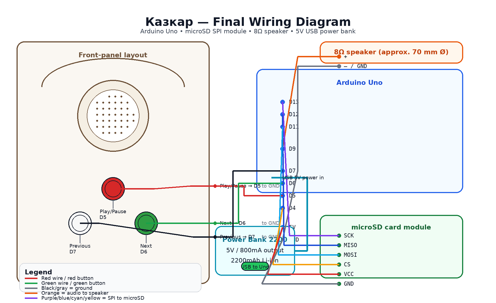

# Schematic / Wiring Diagram

## About this diagram

This repository includes a rendered wiring diagram of the final documented build. It maps the final front-panel control layout to the Arduino pinout, SPI microSD wiring, speaker connection, and USB power.

The diagram reflects:

- Arduino Uno
- microSD card module over SPI
- 3 momentary pushbuttons switching to ground
- 8Ω speaker on pin 9
- 5V USB power-bank operation

## Wiring summary

### Buttons

- **Red / Play-Pause** — D5
- **Green / Next** — D6
- **White / Previous** — D7
- each button returns to **GND**
- internal pull-ups are enabled in firmware

### microSD module

- **CS** — D4
- **MOSI** — D11
- **MISO** — D12
- **SCK** — D13
- **VCC** — 5V
- **GND** — GND

### Speaker

- positive lead driven from **D9**
- negative lead to **GND**

### Power

- Arduino Uno powered from a **5V USB power bank** in normal portable use

## Future extension

If the project is revised later, this repo can be extended with:

- a full Fritzing breadboard file
- a formal schematic capture
- or a KiCad schematic and PCB
